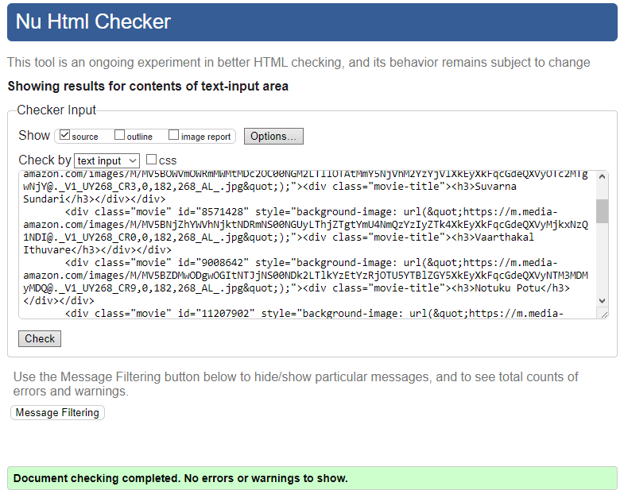

# OCR-P6
Projet n°6 - Développez une interface utilisateur pour une application web Python

How to run project :
===============

## 1 : Run API
  - Fork API from https://github.com/OpenClassrooms-Student-Center/OCMovies-API-EN-FR
  - $ python manage.py runserver

## 2 : Preview
  - Open index.html in browser

Files description :
===============

**index.hmtl** > This file serves as the structural framework for the web application, containing the HTML markup that defines the layout and content elements of the user interface.

**style.css** > This file provides the styling for the web application, defining CSS rules that control the appearance of HTML elements, including colors, fonts, and layout properties.

**script.js** > This file handles the generation of HTML and CSS elements, as well as the creation of dynamic elements based on data retrieved from the API.

### w3c validation :

HTML

CSS

### Browsers compatibility

**Chrome 122.0.6261.94 (Build officiel) (64 bits)**

**Firefox 123.0 (64 bits)**

**Opera GX LVL5 (core: 107.0.5045.37)**

